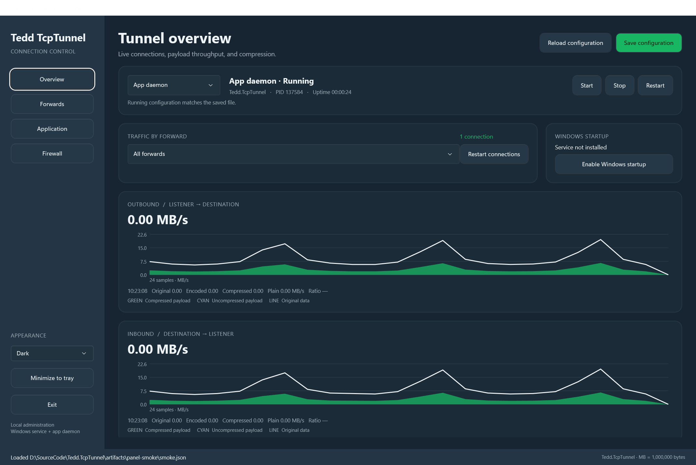

# Tedd.TcpTunnel

TCP forwarding for Windows and Linux, with IPv4/IPv6, source-network ACLs, configurable compression,
authenticated encryption, structured logging, service management, bounded batching, SOCKS5 CONNECT,
multiple forwarding setups, and concurrent connections.

[Website](https://tedd.no/Tedd.TcpTunnel/) ·
[Downloads](https://github.com/tedd/Tedd.TcpTunnel/releases) ·
[Build artifacts](https://github.com/tedd/Tedd.TcpTunnel/actions/workflows/build.yml?query=branch%3Adeploy)

## Windows control panel

Launch **Tedd TcpTunnel** from the Start menu, or run `Tedd.TcpTunnel.ControlPanel.exe`
beside `tcptunnel.exe` in the Windows portable package. The .NET MAUI app uses the
Tedd Defrag light/dark palette and follows the Windows theme unless you select an override.
It requests administrator access to manage services, protected configuration files, and firewall rules.



The screenshot shows real loopback traffic. Rates depend on the connection and data.

- **Forwards:** add or remove forwards and edit every supported option, including endpoints,
  compression, encryption, TLS, ACLs, retries, batching, sockets, and packet capture.
  Lists and key maps use JSON arrays and objects; combined flags accept comma-separated names.
- **Application:** choose a named service, open a configuration file, configure logging and
  update checks, and install or uninstall the Windows service. New configurations default to
  `%ProgramData%\Tedd.TcpTunnel\tunnel.json`.
- **Save configuration:** validates and atomically saves the file, then asks whether to restart
  the service/app daemon, disconnect existing connections only, or apply later. Disconnecting
  sessions keeps the current settings; a full runtime restart loads all saved options.
  A pending indicator identifies saved settings that are not active. Concurrent file edits
  are rejected until you reload.
- **Windows service:** view its actual Windows status, start, stop, or restart it.
  **Enable Windows startup** installs an automatic service if needed, or enables automatic
  startup for the selected installed service. Disabling startup changes it to manual.
- **App daemon:** runs the forwarding engine inside the control panel. Minimize or close the
  window to keep it in the notification area. Use the tray menu to restore it or exit;
  exiting asks to stop an active app daemon. An installed service continues independently.
- **Firewall:** preview, apply, update, or remove scoped inbound TCP rules for the selected
  runtime. Defaults allow the local subnet on Domain/Private profiles. Loopback listeners and
  dynamic ports are skipped. Select Public or broader peers explicitly when needed.
  Rules are tied to the executable, listener address, and port; source ACLs remain effective.

### Live throughput and compression

Select **All forwards** or one forward on **Overview**. The two graphs show listener-to-destination (**outbound**)
and destination-to-listener (**inbound**) traffic. Hover or touch a sample to inspect original
and encoded MB/s, compressed and plain payload MB/s, and the original-to-encoded compression
ratio. The green and cyan areas stack to encoded throughput; the line shows original data.
MB means 1,000,000 bytes. A ratio below 1 indicates expansion; idle samples have no ratio.

The panel samples cumulative counters about once per second and retains up to 120 samples.
Counters measure successfully forwarded payload after encoding and before decoding. They exclude
TCP/IP, TLS, protocol headers, heartbeats, and authentication tags. A compressed payload can
therefore be larger than its original data. Raw/SOCKS payload is counted as plain.
Restarting a daemon or losing the control connection resets the displayed history.

The daemon exposes versioned, length-bounded JSON messages over a local named pipe whenever
it runs with `--config`. Windows service pipes allow LocalSystem and elevated administrators
and deny network access; foreground pipes require the same user/elevation. The panel verifies
the service pipe's process ID against Windows before transmitting configuration. Status responses
contain counters and endpoints, while configuration is fetched through a separate operation.
The service never accepts an arbitrary file path from a control request.

The portable CLI updater replaces `tcptunnel.exe` only. To upgrade the portable control panel,
exit it and replace both executables from the Windows ZIP, or use the MSI/EXE installer.

## Application integration

The **Tedd.TcpTunnel** library packages both client and server APIs for NuGet.
Embed forwarding with `TunnelHost`/`Listener`, connect directly with
`TunnelClient.ConnectAsync`, or handle an accepted connection with `TunnelServer.AcceptAsync`.
The direct APIs return a duplex `Stream` with compression, authenticated encryption,
and half-close support, without application-side TCP connections.

See the [API guide and examples](docs/api.md) and [runnable sample](samples/LibraryDemo).
The library targets .NET 11. Package publishing follows the GitHub Release workflow;
maintainer setup is documented in the API guide.

## Install

| Platform | Architectures | Packages |
| --- | --- | --- |
| Windows | x64, ARM64 | MSI, EXE setup, portable ZIP |
| Linux (glibc) | x64, ARM64 | Portable ZIP |

The following commands resolve the current published release and select x64 or ARM64
automatically.

### Windows

PowerShell:

```powershell
$ErrorActionPreference = 'Stop'
$arch = switch ([Runtime.InteropServices.RuntimeInformation]::OSArchitecture) {
    'X64' { 'x64' }
    'Arm64' { 'arm64' }
    default { throw 'TcpTunnel supports Windows x64 and ARM64.' }
}
$release = Invoke-RestMethod 'https://api.github.com/repos/tedd/Tedd.TcpTunnel/releases/latest'
$asset = $release.assets | Where-Object name -Like "*-win-$arch-setup.exe" | Select-Object -First 1
if (!$asset) { throw "No Windows $arch installer is present in the latest release." }
$installer = Join-Path $env:TEMP $asset.name
Invoke-WebRequest -Uri $asset.browser_download_url -OutFile $installer
Start-Process -FilePath $installer -Wait
Remove-Item -LiteralPath $installer
```

Command Prompt:

```bat
powershell -NoProfile -ExecutionPolicy Bypass -Command "$ErrorActionPreference='Stop'; $arch=if($env:PROCESSOR_ARCHITECTURE -eq 'ARM64'){'arm64'}else{'x64'}; $release=Invoke-RestMethod 'https://api.github.com/repos/tedd/Tedd.TcpTunnel/releases/latest'; $asset=$release.assets | Where-Object name -Like ('*-win-'+$arch+'-setup.exe') | Select-Object -First 1; if(!$asset){throw 'No compatible Windows installer is present in the latest release.'}; $installer=Join-Path $env:TEMP $asset.name; Invoke-WebRequest -Uri $asset.browser_download_url -OutFile $installer; Start-Process -FilePath $installer -Wait; Remove-Item -LiteralPath $installer"
```

Bash (Git Bash):

```bash
case "$(uname -m)" in
  x86_64) arch=x64 ;;
  arm64|aarch64) arch=arm64 ;;
  *) echo "TcpTunnel supports Windows x64 and ARM64." >&2; exit 1 ;;
esac
release_url="$(curl -fsSL -o /dev/null -w '%{url_effective}' https://github.com/tedd/Tedd.TcpTunnel/releases/latest)"
version="${release_url##*/v}"
installer="$(mktemp --suffix=.exe)"
curl -fL "https://github.com/tedd/Tedd.TcpTunnel/releases/download/v$version/tcptunnel-$version-win-$arch-setup.exe" -o "$installer" &&
  "$installer" &&
  rm -f "$installer"
```

The EXE setup installs the MSI, registers upgrades and uninstallation, and adds the
installation directory to the system PATH. Open a new terminal after installation.

### Linux

Bash:

```bash
case "$(uname -m)" in
  x86_64) arch=x64 ;;
  arm64|aarch64) arch=arm64 ;;
  *) echo "TcpTunnel supports Linux x64 and ARM64." >&2; exit 1 ;;
esac
release_url="$(curl -fsSL -o /dev/null -w '%{url_effective}' https://github.com/tedd/Tedd.TcpTunnel/releases/latest)"
version="${release_url##*/v}"
archive="$(mktemp --suffix=.zip)"
install_root="${XDG_DATA_HOME:-$HOME/.local/share}/tcptunnel"
bin_dir="$HOME/.local/bin"
curl -fL "https://github.com/tedd/Tedd.TcpTunnel/releases/download/v$version/tcptunnel-$version-linux-$arch.zip" -o "$archive" &&
  mkdir -p "$install_root" "$bin_dir" &&
  unzip -oq "$archive" -d "$install_root" &&
  chmod +x "$install_root/tcptunnel" &&
  ln -sfn "$install_root/tcptunnel" "$bin_dir/tcptunnel" &&
  rm -f "$archive"
```

PowerShell 7:

```powershell
$ErrorActionPreference = 'Stop'
$arch = switch ([Runtime.InteropServices.RuntimeInformation]::OSArchitecture) {
    'X64' { 'x64' }
    'Arm64' { 'arm64' }
    default { throw 'TcpTunnel supports Linux x64 and ARM64.' }
}
$release = Invoke-RestMethod 'https://api.github.com/repos/tedd/Tedd.TcpTunnel/releases/latest'
$asset = $release.assets | Where-Object name -Like "*-linux-$arch.zip" | Select-Object -First 1
if (!$asset) { throw "No Linux $arch package is present in the latest release." }
$archive = Join-Path ([IO.Path]::GetTempPath()) $asset.name
$installRoot = Join-Path $HOME '.local/share/tcptunnel'
$binDir = Join-Path $HOME '.local/bin'
Invoke-WebRequest -Uri $asset.browser_download_url -OutFile $archive
New-Item -ItemType Directory -Force -Path $installRoot, $binDir | Out-Null
Expand-Archive -LiteralPath $archive -DestinationPath $installRoot -Force
& chmod +x (Join-Path $installRoot 'tcptunnel')
& ln -sfn (Join-Path $installRoot 'tcptunnel') (Join-Path $binDir 'tcptunnel')
Remove-Item -LiteralPath $archive
```

The Linux commands require `curl` and `unzip`, install under `~/.local/share/tcptunnel`,
and link the executable into `~/.local/bin`. Ensure `~/.local/bin` is on `PATH`.

Packages are self-contained: a separate .NET installation is unnecessary. The portable
CLI is a single executable; Windows packages also include the self-contained MAUI control panel.
Both are accompanied by documentation, a license, an example
configuration, and an installation marker. Native runtime components may extract on first run.

Windows packages are unsigned unless the release maintainer signs them.

To run a portable Linux package without installing it, extract the ZIP and run:

```sh
chmod +x tcptunnel
./tcptunnel --config tunnel.example.json --check
./tcptunnel --config tunnel.example.json
```

The application targets **.NET 11 RC1**, a prerelease runtime. GitHub Actions builds are
available before a release is published; downloading those artifacts requires a GitHub account.

## Forward a connection

```sh
tcptunnel --forward web --mode Raw --listen-port 8080 --remote-host 192.0.2.10 --remote-port 80
```

Connect your application to `127.0.0.1:8080`. Each accepted connection opens its own
connection to the destination. Raw mode works with ordinary TCP services.

Client/Server pairs support authenticated shared-key encryption after compression.
Raw and SOCKS5 modes, and pairs with `Encryption.Algorithm=None`, carry plaintext. Listeners
bind to loopback by default. Changing the bind address exposes that interface.

### IPv4 and IPv6

`ListenAddress` accepts an IPv4 or IPv6 literal. Use `0.0.0.0` for all IPv4 interfaces, `::`
for all IPv6 interfaces, `127.0.0.1` for IPv4 loopback, or `::1` for IPv6 loopback. IPv6
listeners use `Socket.DualMode=true` by default, so an `::` listener accepts both IPv6 and
IPv4 on operating systems that support dual-stack sockets. Set it to `false` for IPv6 only.

`RemoteHost` accepts IPv4 and IPv6 literals or a DNS name. DNS destinations use the runtime's
address-family selection and connection racing. Write IPv6 literals without URL brackets, for
example `--remote-host 2001:db8::20`.

### Source ACLs

Each forward can allow or deny exact source IP addresses and CIDR subnets in either address
family. Deny rules take precedence. An empty allow list permits sources not denied; a non-empty
allow list rejects sources that match no allow rule. IPv4-mapped IPv6 peers are evaluated as IPv4.

```json
{
  "Name": "sql",
  "ListenAddress": "::",
  "ListenPort": 14330,
  "RemoteHost": "2001:db8::20",
  "RemotePort": 1433,
  "AccessControl": {
    "Allow": ["192.0.2.0/24", "2001:db8:100::/48", "203.0.113.7"],
    "Deny": ["192.0.2.128/25"]
  }
}
```

Repeat `--access-control:allow` or `--access-control:deny` to supply rules on the CLI. ACLs
are evaluated immediately after accept, before SOCKS or tunnel handshakes and before a
destination connection is opened.

## Compress a link

Run a tunnel server near the destination and a client near the application. The examples
below are equivalent.

### Bash

Server:

```bash
tcptunnel --forward server --mode Server \
  --listen-address 0.0.0.0 --listen-port 9001 \
  --remote-host 127.0.0.1 --remote-port 5432 \
  --compression Brotli --compression-history true
```

Client:

```bash
tcptunnel --forward client --mode Client \
  --listen-address 127.0.0.1 --listen-port 9000 \
  --remote-host tunnel.example --remote-port 9001 \
  --compression Brotli --compression-history true
```

### PowerShell

Server:

```powershell
tcptunnel --forward server --mode Server `
  --listen-address 0.0.0.0 --listen-port 9001 `
  --remote-host 127.0.0.1 --remote-port 5432 `
  --compression Brotli --compression-history true
```

Client:

```powershell
tcptunnel --forward client --mode Client `
  --listen-address 127.0.0.1 --listen-port 9000 `
  --remote-host tunnel.example --remote-port 9001 `
  --compression Brotli --compression-history true
```

### Command Prompt

Server:

```bat
tcptunnel --forward server --mode Server ^
  --listen-address 0.0.0.0 --listen-port 9001 ^
  --remote-host 127.0.0.1 --remote-port 5432 ^
  --compression Brotli --compression-history true
```

Client:

```bat
tcptunnel --forward client --mode Client ^
  --listen-address 127.0.0.1 --listen-port 9000 ^
  --remote-host tunnel.example --remote-port 9001 ^
  --compression Brotli --compression-history true
```

Connect the application to `127.0.0.1:9000`. Both directions use compression. Each application
connection has a separate TCP tunnel and compression context. The pair must use matching
compression and history settings, with one Client and one Server. Buffer sizes and quality
may differ. TTN2 framing validates the protocol, roles, codec, history flag, and frame lengths.
Both peers must support TTN2; it does not interoperate with the archived experimental transport.

### Compression choices

| `Compression` | Intended use | Controls |
| --- | --- | --- |
| `None` | Avoid compression CPU work | Batching and socket controls |
| `Lz4` | Fast block compression | `CompressionLevel`; SmallestSize selects LZ4 HC |
| `Brotli` | Compression ratio and repeated content | `BrotliQuality` 0–11, `BrotliWindow` 10–24 |
| `Zstandard` | General-purpose speed/ratio trade-off | `ZstandardLevel` -5–22 |
| `Deflate` | Raw DEFLATE blocks | `CompressionLevel` |
| `GZip` | GZip blocks | `CompressionLevel` |
| `ZLib` | ZLib blocks | `CompressionLevel` |

`CompressionLevel` accepts `Fastest`, `Optimal`, `SmallestSize`, and `NoCompression`.
Brotli and Zstandard use their dedicated numeric controls. Brotli, Deflate, GZip and ZLib
use `System.IO.Compression`; LZ4 uses K4os, and Zstandard uses ZstdSharp.

`CompressionHistory=true` is supported with Brotli. The encoder retains state across frames,
reusing content in its sliding window. It does not train a persistent model, share dictionaries
between connections, or retain history after disconnect. Other codecs use independent blocks.
Higher quality and larger windows consume more CPU and memory. Already compressed or encrypted
traffic generally has little to gain.

### Latency and batching

`BufferSize` is the maximum application-data frame size: 1 KiB–1 MiB, default 64 KiB.
`BatchMilliseconds=0` forwards each read immediately. A positive value collects bytes until
the buffer fills or the deadline expires. The deadline starts with the first bytes and does
not restart for subsequent reads. OS scheduling and backpressure can extend delivery time.

Batching also works without compression. `Socket.NoDelay=true` disables Nagle by default.
Nagle and application batching are separate controls; enabling both can add delay.

Example client settings to benchmark with your traffic:

| Priority | Settings |
| --- | --- |
| Low batching latency | `--compression Lz4 --batch-milliseconds 0` |
| Larger transfers | `--compression Zstandard --buffer-size 262144 --batch-milliseconds 2` |
| Higher compression | `--compression Brotli --brotli-quality 9 --brotli-window 22 --compression-history true --batch-milliseconds 10` |

Run a matching Server for each compressed client.

## Encrypt a link

Generate one independent shared key per client:

```sh
tcptunnel --generate-key
```

The output is 32 cryptographically random bytes encoded as 44 Base64 characters. Deliver
it to the client and server through a trusted channel. Use generated keys, not passwords.

Configure the server's allowlist in `server.json` (replace each placeholder with a different
generated key):

```json
{
  "Forwards": [{
    "Name": "server", "Mode": "Server",
    "ListenAddress": "0.0.0.0", "ListenPort": 9001,
    "RemoteHost": "127.0.0.1", "RemotePort": 5432,
    "Compression": "Lz4",
    "Encryption": {
      "Algorithm": "ChaCha20Poly1305",
      "Keys": {
        "laptop": "REPLACE_WITH_LAPTOP_KEY",
        "desktop": "REPLACE_WITH_DESKTOP_KEY"
      }
    }
  }]
}
```

The laptop's `client.json` contains only its own key:

```json
{
  "Forwards": [{
    "Name": "client", "Mode": "Client", "ListenPort": 9000,
    "RemoteHost": "tunnel.example", "RemotePort": 9001,
    "Compression": "Lz4",
    "Encryption": {
      "Algorithm": "ChaCha20Poly1305",
      "KeyId": "laptop",
      "Key": "REPLACE_WITH_LAPTOP_KEY"
    }
  }]
}
```

Run `tcptunnel --config server.json` and `tcptunnel --config client.json` on their respective
machines. Validate either file with `--check`. Restrict file permissions to the account
running TcpTunnel. `--write-config` includes configured secrets; protect its output too.

| `Encryption.Algorithm` | Cipher | Shared key | Authentication tag |
| --- | --- | --- | --- |
| `None` (default) | Plaintext; no authentication | None | None |
| `ChaCha20Poly1305` | ChaCha20-Poly1305 | 256 bits | 128 bits |
| `AesGcm` | AES-256-GCM | 256 bits | 128 bits |
| `AesCcm` | AES-256-CCM | 256 bits | 128 bits |

ChaCha20-Poly1305 is the suggested general-purpose choice and is also used by WireGuard.
All three implementations come from `System.Security.Cryptography`; no cryptographic
primitive is implemented by this project. Platform support is checked before listening.
Both peers must explicitly select the same algorithm; there is no automatic downgrade.
See [RFC 8439](https://www.rfc-editor.org/rfc/rfc8439.html),
[WireGuard's cryptography](https://www.wireguard.com/protocol/), and
[.NET platform support](https://learn.microsoft.com/en-us/dotnet/standard/security/cross-platform-cryptography).

`Encryption.Keys` accepts up to 4096 server entries. IDs are case-sensitive and contain
1–64 ASCII letters, digits, hyphens or underscores. Each key grants access to that forward's
destination. To revoke one client, remove its entry and restart the server. Restarting closes
all existing connections; retained clients can reconnect with their unchanged keys. Configuration
is loaded at startup. For key rotation, add a new ID/key, restart, migrate the client, then
remove the old entry and restart again. Clients must not share a key if separate revocation
is required.

For temporary command-line configuration, append these arguments to the Client/Server
commands above (the same syntax works in Bash, PowerShell and Command Prompt):

```sh
# Client
--encryption:algorithm ChaCha20Poly1305 --encryption:key-id laptop --encryption:key BASE64_KEY
# Server; repeat --encryption:keys:ID for additional clients
--encryption:algorithm ChaCha20Poly1305 --encryption:keys:laptop BASE64_KEY
```

Command-line secrets can appear in process listings and shell history. Configuration files
are preferable for production.

Encrypted peers use TTN3: the shared key authenticates both peers and the handshake transcript
before the server opens a destination connection. Fresh random values from both peers feed
[HKDF-SHA-256](https://www.rfc-editor.org/rfc/rfc5869.html), producing separate traffic secrets
for each direction and connection. Each direction refreshes its record key every 1024 frames.
Unique sequence-based nonces and authenticated frame headers detect modification, replay,
reordering, and forged heartbeats or half-closes. Authentication precedes decompression and
application delivery. Failed authentication or a missing authenticated half-close resets the
application connection. Every frame, including a heartbeat or half-close, adds a 16-byte tag.
Unencrypted pairs use TTN2 and remain compatible with TTN2 peers.

The algorithms are standardized; TTN3 is a project-specific protocol without an independent
cryptographic audit. A shared-key-only handshake has **no forward secrecy**: possession of a
client's key permits decrypting its recorded sessions and impersonating either peer for that
key. Key IDs, frame lengths and timing remain observable. Compression can expose secrets through
length differences when attacker-controlled text and secrets share a compression context;
use `Compression=None` for such traffic. Encryption covers the tunnel link; application-side
connections require endpoint TLS for encryption. Opt-in PCAP captures contain decrypted application data.

## TLS and SQL Server

`ListenTls` terminates TLS from the application at the tunnel Client.
`RemoteTls` establishes TLS from the tunnel Server to the destination. Compression
operates on the decrypted application bytes in both directions:

```text
SQL application -- TLS --> Client -- compressed + tunnel-encrypted --> Server -- TLS --> SQL Server
```

Endpoint TLS and `Encryption` protect separate connections. Configure shared-key
tunnel encryption as described above to protect the link carrying the compressed data.
With endpoint TLS disabled, forwarding an already encrypted SQL stream provides little
compression. TLS termination also makes opt-in PCAP captures readable as application data.

| Endpoint mode | Connection behavior |
| --- | --- |
| `None` (default) | Ordinary TCP forwarding |
| `Tls` | TLS starts immediately; suitable for services such as HTTPS |
| `SqlServer` | TDS 7.x PRELOGIN negotiation, then full-session TLS 1.2 |
| `SqlServerStrict` | TLS first with TDS 8.0 ALPN; for SQL Server 2022+ and compatible `Encrypt=Strict` drivers |

For `SqlServer`, configure `ListenTls.Mode=SqlServer` on the Client and
`RemoteTls.Mode=SqlServer` on the Server. Both peers must support this setting;
a mismatch is rejected during tunnel negotiation. PRELOGIN capabilities are relayed,
and the tunnel requires full-session encryption rather than login-only encryption.
TLS uses the OS cryptographic implementation; TDS changes the handshake framing,
not the encryption algorithm. See Microsoft's [TDS PRELOGIN specification](https://learn.microsoft.com/en-us/openspecs/windows_protocols/ms-tds/60f56408-0188-4cd5-8b90-25c6f2423868).

### SQL Server example

Generate a shared tunnel key with `tcptunnel --generate-key`, then replace both
`REPLACE_WITH_GENERATED_KEY` values below with the same output.

On the destination side, save `sql-server.json`:

```json
{
  "Forwards": [{
    "Name": "sql-server", "Mode": "Server",
    "ListenAddress": "0.0.0.0", "ListenPort": 9001,
    "RemoteHost": "sql01.corp.example.com", "RemotePort": 1433,
    "Compression": "Lz4",
    "Encryption": {
      "Algorithm": "AesGcm",
      "Keys": { "sql-client": "REPLACE_WITH_GENERATED_KEY" }
    },
    "RemoteTls": {
      "Mode": "SqlServer",
      "TargetHost": "sql01.corp.example.com",
      "TrustServerCertificate": false
    }
  }]
}
```

On the application side, save `sql-client.json`:

```json
{
  "Forwards": [{
    "Name": "sql-client", "Mode": "Client",
    "ListenAddress": "127.0.0.1", "ListenPort": 14330,
    "RemoteHost": "tunnel.example.com", "RemotePort": 9001,
    "Compression": "Lz4",
    "Encryption": {
      "Algorithm": "AesGcm",
      "KeyId": "sql-client", "Key": "REPLACE_WITH_GENERATED_KEY"
    },
    "ListenTls": {
      "Mode": "SqlServer",
      "CertificatePath": "sql-client.pfx"
    }
  }]
}
```

Supply a server-authentication certificate with its private key in `sql-client.pfx`,
or generate a persistent self-signed certificate:

```sh
tcptunnel --generate-certificate sql-client.pfx --listen-tls:self-signed-name localhost
tcptunnel --config sql-server.json --check
tcptunnel --config sql-client.json --check
```

Run each configuration on its respective machine:

```sh
tcptunnel --config sql-server.json
tcptunnel --config sql-client.json
```

Connect the SQL application to `Server=localhost,14330;Encrypt=True;TrustServerCertificate=False;`,
with its normal database and authentication settings. The application must trust the CA
or self-signed certificate used by the **local listener**, whose SAN must match the
application's connection name. An internal enterprise CA is suitable; a public CA is not required.

For a temporary self-signed listener, replace `CertificatePath` with
`"GenerateSelfSigned": true, "SelfSignedName": "localhost"`. This creates a certificate
once per listener startup, valid for one year, with RSA-2048, SHA-256, Server Authentication
EKU, and a SAN for the specified DNS name or IP. `localhost` also includes both loopback IPs.
It changes on restart. A non-Strict SQL driver can use `TrustServerCertificate=True` for
this local certificate; that bypass applies only to the application-to-listener connection.

To connect to a destination with an invalid certificate, explicitly set
`RemoteTls.TrustServerCertificate=true` on the tunnel Server, or pass
`--remote-tls:trust-server-certificate`. This bypasses certificate chain, validity,
and hostname checks while retaining encryption; it does **not** authenticate the
destination. The default validates the destination against the OS trust store, using
`RemoteTls.TargetHost` for SNI and certificate identity, or `RemoteHost` when omitted.

For TDS 8.0, use `SqlServerStrict` at both endpoints and connect with `Encrypt=Strict`.
The application must validate the listener certificate, and destination validation is
mandatory; `TrustServerCertificate=true` is rejected in this mode. TLS 1.3 availability
depends on the OS, SQL Server, and driver. TLS termination changes the TLS peer identity:
authentication that requires end-to-end channel binding, such as enforced SQL Server
Extended Protection, is incompatible with splitting the connection.

### Certificates and cipher suites

`ListenTls.CertificatePath` accepts a PFX/P12 containing the private key.
For PEM, also set `ListenTls.CertificateKeyPath`. `CertificatePassword` unlocks a
password-protected PFX or encrypted PEM key. Relative certificate and key paths in a
JSON configuration resolve from that file's directory. `--check` loads the certificate
and verifies that the private key is available before any listener opens.

`--generate-certificate PATH` writes a PFX and refuses to overwrite an existing file.
Use `--listen-tls:self-signed-name NAME` to choose its identity and
`ListenTls.CertificatePassword` in a restricted configuration file to protect the
export. Generated files use owner-only permissions on Linux; restrict certificate,
private-key and configuration access to the service account on Windows.

`Protocols` defaults to `"Tls12, Tls13"`; SSL and TLS 1.0/1.1 are rejected.
`SqlServer` selects TLS 1.2 for its TDS 7.x handshake. Cipher suites are negotiated
by the OS TLS stack, using its defaults when `CipherSuites` is empty.
Standard suites include AES-128-GCM, AES-256-GCM and ChaCha20-Poly1305 with ECDHE
for TLS 1.2, and their TLS 1.3 equivalents, subject to platform support.

On Linux, an explicit list can restrict negotiation, for example:

```json
"RemoteTls": {
  "Mode": "SqlServer",
  "CipherSuites": [
    "TLS_ECDHE_RSA_WITH_AES_128_GCM_SHA256",
    "TLS_ECDHE_RSA_WITH_AES_256_GCM_SHA384"
  ]
}
```

The same list is supported on `ListenTls`. On Windows, use Schannel OS policy;
explicit per-forward lists are rejected. This follows [.NET TLS platform behavior](https://learn.microsoft.com/en-us/dotnet/core/extensions/sslstream-best-practices).
Direct TLS permits either endpoint independently in `Mode=Raw`; SQL Server TDS 7.x
termination in Raw mode requires `SqlServer` at both endpoints. SOCKS does not support
endpoint TLS.

## Multiple forwarding setups

```json
{
  "Forwards": [
    { "Name": "database", "Mode": "Raw", "ListenPort": 5433,
      "RemoteHost": "database.example", "RemotePort": 5432 },
    { "Name": "proxy", "Mode": "Socks5", "ListenPort": 1080, "MaxConnections": 256 }
  ],
  "Update": { "CheckOnStartup": true, "Repository": "tedd/Tedd.TcpTunnel" },
  "Logging": { "Level": "Information", "Console": true, "File": null }
}
```

```sh
tcptunnel --config tunnel.json
```

The same setup can be expressed entirely on the command line:

```sh
tcptunnel --forward database --mode Raw --listen-port 5433 --remote-host database.example --remote-port 5432 --forward proxy --mode Socks5 --listen-port 1080 --max-connections 256
```

`--forward NAME` selects an existing setup or adds one. Subsequent short options apply to it.
Forwards have independent settings and connection limits. A listener startup failure stops
the instance; an individual connection failure is logged and isolated.

### SOCKS5

`Mode=Socks5` provides SOCKS5 CONNECT with IPv4, IPv6, and domain-name targets and the
no-authentication method. BIND and UDP ASSOCIATE are not supported. SOCKS mode is an
uncompressed local proxy; it does not negotiate dynamic targets through a Client/Server pair.
Non-loopback binding requires `AllowRemoteSocks=true` and appropriate network access controls.

## Configuration and command line

Every JSON field is available on the CLI. CLI values override the file. Nested fields use
`:` or `.`, and names accept PascalCase, camelCase, or hyphenation.

```sh
tcptunnel --config tunnel.json --forwards:0:socket:no-delay false
tcptunnel --config tunnel.json --forward database --retry:attempts 5
tcptunnel --config tunnel.json --update:check-on-startup false
tcptunnel --write-config tunnel.full.json
tcptunnel --help
```

`--write-config` writes all effective values and exits. `--help` includes every option and
default. Unknown JSON properties and CLI options, invalid enums, out-of-range values,
duplicate names, and incompatible combinations are rejected. Booleans accept `true`/`false`;
a boolean flag without a value means `true`. Use `null` to clear optional strings. JSON
supports comments and trailing commas.

| Command | Behavior |
| --- | --- |
| `--config PATH` | Load JSON |
| `--write-config PATH` | Write effective configuration and exit |
| `--check` | Validate without opening sockets |
| `--generate-key` | Generate a 32-byte Base64 shared key and exit |
| `--generate-certificate PATH` | Write a self-signed listener PFX and exit |
| `--debug` | Set `Logging.Level=Debug` |
| `--log-file PATH` | Append structured logs to a file |
| `--install-service --config PATH` | Install and start a Windows or systemd service |
| `--uninstall-service` | Stop and uninstall the service |
| `--service-name NAME` | Select a named service instance |
| `--help` / `-h` | Usage and complete option template |
| `--version` | Application version |
| `--check-update` | Check GitHub and exit |
| `--update-now` | Offer and apply an update |
| `--update-now --yes` | Apply without an interactive prompt |

### Connections, retries, and threading

- `MaxConnections` defaults to 1024 per forward; `Backlog` defaults to 512.
- `Retry.Attempts` includes the first attempt. Connections have a timeout and capped
  exponential backoff, with optional jitter.
- Retries occur **before forwarding starts**. Established streams are not reconnected or
  replayed, which could duplicate application operations. Applications must reconnect.
- `HandshakeTimeoutMilliseconds` limits tunnel, SOCKS, and endpoint TLS/TDS negotiation.
- `IdleTimeoutMilliseconds=0` disables application-data idle expiry. Heartbeats do not count
  as application activity.
- Half-closes preserve the other direction until it finishes. Cancellation closes active
  connections. Ctrl+C and Linux SIGTERM stop the instance.
- `Execution=Async` uses asynchronous sockets and is the default for many connections.
- `Execution=Dedicated` uses two OS threads per connection with blocking I/O. It can suit
  a small number of busy connections. Set an appropriate connection limit and benchmark both.

### Keepalive and socket controls

`HeartbeatMilliseconds` sends tunnel no-op frames on idle outgoing tunnel directions. Peers
consume them without delivering them to applications. Zero disables them. Raw and SOCKS
connections use TCP keepalive instead.

`Socket` exposes `NoDelay`, `KeepAlive`, `KeepAliveSeconds`, `KeepAliveIntervalSeconds`,
`KeepAliveRetryCount`, `SendBufferSize`, `ReceiveBufferSize`, `DualMode`, and `ReuseAddress`.
Zero buffer sizes preserve OS defaults. IPv6 `DualMode` applies to listening sockets and
defaults to `true`.

Linux exposes `LinuxQuickAck`, `LinuxUserTimeoutMilliseconds`, and `LinuxCongestionControl`
(for example, `cubic`, or `bbr` when available). Quick ACK is rearmed after receives. Windows
exposes optional `WindowsLoopbackFastPath` for loopback connections. Optional tuning failures
produce warnings; kernel availability and permissions determine which settings apply.

### Logging and packet capture

Operational events are one JSON object per line on stderr. Connection attempt, ACL denial,
destination retry, establishment, failure, and closure events include a per-forward connection
ID and the relevant endpoints. Closure events include duration. Set `Logging.Level=Debug` or
pass `--debug` for destination-selection, handshake, shutdown-cancellation, and exception-detail
events. `Logging.Console=false` disables stderr; `Logging.File` appends the same JSON lines to a
file. Relative log paths in a configuration file resolve from that file's directory.

Capture remains separately opt-in:

```sh
tcptunnel --config tunnel.json --forward database --capture:directory captures --capture:max-file-bytes 67108864 --capture:retained-files 4
```

Capture writes classic **PCAP / LINKTYPE_RAW (101)**, readable by Wireshark and tcpdump.
It records plaintext application data in reconstructed IPv4/IPv6 TCP segments, with valid
checksums and synthetic per-direction sequence numbers. It is a stream-level capture, not a
record of original packet boundaries, handshakes, retransmissions, or physical-interface timing.

Files rotate at `MaxFileBytes`; `RetainedFiles` bounds a forward's files within the current
process run. Runs have unique prefixes. Retain/remove older runs according to your storage
policy. Captures can contain credentials and other payloads. Capture write failures terminate
the affected connection and appear in operational logs.

## Run as a service

Service installation requires a published self-contained executable and a persistent JSON
configuration file. The executable validates the configuration, registers one automatic-start
service, and starts it. Use distinct service names for independent instances.

From an elevated Windows terminal:

```powershell
tcptunnel --install-service --service-name sql-tunnel --config C:\ProgramData\Tedd.TcpTunnel\sql-tunnel.json
tcptunnel --uninstall-service --service-name sql-tunnel
```

The executable runs under the Windows Service Control Manager and responds to stop and shutdown
controls. When `Logging.File` is unset, a Windows service writes to
`%ProgramData%\Tedd.TcpTunnel\tcptunnel.log`; set an explicit file for separate instance logs.

On a systemd-based Linux host:

```bash
sudo "$(command -v tcptunnel)" --install-service --service-name sql-tunnel --config /etc/tcptunnel/sql-tunnel.json
sudo "$(command -v tcptunnel)" --uninstall-service --service-name sql-tunnel
journalctl -u sql-tunnel.service
```

The Linux command writes `/etc/systemd/system/sql-tunnel.service`, reloads systemd, and enables
and starts the unit. Standard error is captured by the journal. Installation does not copy the
executable or configuration; keep both paths stable. Uninstall the service before removing a
Windows package that owns its executable.

## Updates

Startup and periodic checks query the configured GitHub repository. Set
`Update.CheckOnStartup=false` to disable automatic checks. `CheckIntervalHours` controls
the interval, and `IncludePrerelease` controls the release channel.

An available version is offered in the log. Run `tcptunnel --update-now` to review and install.
The updater requires an exact platform asset and its SHA-256 entry in `SHA256SUMS`.
Repository control and HTTPS are the trust boundary; checksums detect corruption but do not
replace independent code signing.

Portable updates stage a verified executable under `.updates`, wait for the invoking process
to exit, and replace the executable in place. The previous binary remains as `.previous`.
Configuration files remain in place. Close other copies if they hold the binary open. The
helper writes `result.txt`; restart your normal forwarding command after success. Failed
replacement leaves the current executable intact. Staging directories can be removed after
confirming the update.

MSI-installed copies launch the verified MSI. EXE setup installs the same MSI, so automatic
selection uses the MSI upgrade path. `Update.InstallKind` can select `msi`, `exe`, or `zip`;
`auto` reads `install-kind.txt`. Installer upgrades use the installer and may require
elevation. In-place ZIP updates require a published single-file build.

## Build, test, benchmark, and release

On Windows, build the MAUI control panel with the repository SDK and the Windows workload:

```powershell
dotnet workload install maui-windows
dotnet build src/Tedd.TcpTunnel.Windows.slnx -c Release
./scripts/smoke-control-panel.ps1
```

The UI smoke script runs loopback traffic, verifies configuration and daemon restart,
and writes screenshots under `artifacts/panel-smoke`. The main cross-platform solution
builds the CLI, management protocol, library, and tests without a MAUI workload.

Install the SDK pinned in `global.json`: **11.0.100-rc.1.26425.128**.

```sh
dotnet restore src/Tedd.TcpTunnel.sln --locked-mode
dotnet build src/Tedd.TcpTunnel.sln -c Release --no-restore
dotnet test --project src/Tedd.TcpTunnel.Tests/Tedd.TcpTunnel.Tests.csproj -c Release --no-progress --coverlet --coverlet-output-format cobertura --results-directory artifacts/coverage
```

Tests use xUnit and Microsoft Testing Platform. They exercise real loopback sockets, both
execution modes, all codecs and encryption algorithms, authentication, replay and tamper rejection, malformed input, batching, concurrent connections, half-closes,
cancellation, retries, SOCKS, captures, and updater failures. The CI gate merges Windows/Linux
reports without excluding production source: at least 97% line coverage overall, 98% in the
transport library, and 83% branch coverage.

BenchmarkDotNet includes archived/current/Pipes copies, codec round trips, Brotli history,
authenticated encryption after compression, and TCP round trips across connection counts, payload sizes, and threading modes:

```sh
dotnet run --project src/Tedd.TcpTunnel.Benchmarks -c Release -- --filter '*StreamCopyBenchmark*' --job short
dotnet run --project src/Tedd.TcpTunnel.Benchmarks -c Release -- --filter '*CompressionBenchmark*' '*BrotliHistoryBenchmark*' --job short
dotnet run --project src/Tedd.TcpTunnel.Benchmarks -c Release -- --filter '*TunnelBenchmark*' --job short
dotnet run --project src/Tedd.TcpTunnel.Benchmarks -c Release -- --filter '*EncryptionBenchmark*' --job short
```

The end-to-end throughput suite starts a destination sink plus a TcpTunnel client and server,
then validates and times complete transfers across the loopback path. On Windows it selects
large DLLs from `System32`; Brotli profiles repeat the largest file on one connection to compare
history reuse against the same history-disabled sequence.

```powershell
dotnet run --project src/Tedd.TcpTunnel.Benchmarks -c Release -- --throughput --target-mib 64 --warmups 1 --iterations 7 --output benchmarks.md --json-output website/benchmarks.json --svg-output website/benchmarks.svg
```

The command records median and peak application-data throughput for 26 compression/encryption profiles. Median
is the primary comparison because it is less sensitive to scheduler and cache outliers. It
writes [benchmarks.md](benchmarks.md), the website data file, and an SVG graph. Supply repeated
`--file PATH` options to replace the Windows corpus. The manually dispatched benchmark workflow
can run either this suite or the BenchmarkDotNet microbenchmarks.

Buffers are pooled. Hot paths use spans/memory, `ValueTask`, and runtime/library vectorized
copy and compression implementations. Connection setup, async scheduling, expired timers,
some codecs, and logging still allocate. Zero allocation for the complete service and
universal throughput improvements are not guaranteed. Benchmark representative workloads.

PowerShell 7 packaging commands:

```powershell
./scripts/package.ps1 -Runtime win-x64 -Installers
./scripts/package.ps1 -Runtime win-arm64 -Installers
./scripts/package.ps1 -Runtime linux-x64
./scripts/package.ps1 -Runtime linux-arm64
```

Outputs are under `artifacts/packages`. Windows builds include a directly runnable
`tcptunnel-VERSION-win-ARCH.exe` client/server executable in addition to the ZIP, MSI,
and setup EXE. Installers use WiX 5.0.2; WiX 6/7 have additional
maintenance-fee terms and are not upgraded automatically. MSI versions use the numeric
release version; publish increasing numeric versions for reliable installer upgrade ordering.
CI extracts each native-platform ZIP, starts the executable, validates the bundled example,
and performs a real atomic update with backup verification. Windows ARM64 packages are
cross-compiled; running their installers requires a Windows ARM64 machine.

The `deploy` branch builds/tests on Windows/Linux, packages four runtime identifiers, and
publishes `website/` through GitHub Pages. Enable Pages with **GitHub Actions** as its source.
Version tags (for example, `v2.0.0`) produce a **draft GitHub Release** with every package and
combined checksums. Review/sign artifacts and publish the draft to expose them to the website
and updater. Benchmarks are manually dispatchable. CI artifacts have 90-day retention;
published release assets remain versioned on GitHub.

Original source and historical benchmark reports are in `archive/`. The archive project
is used only for benchmark comparisons.

## License

[GNU Lesser General Public License v2.1](LICENSE).
