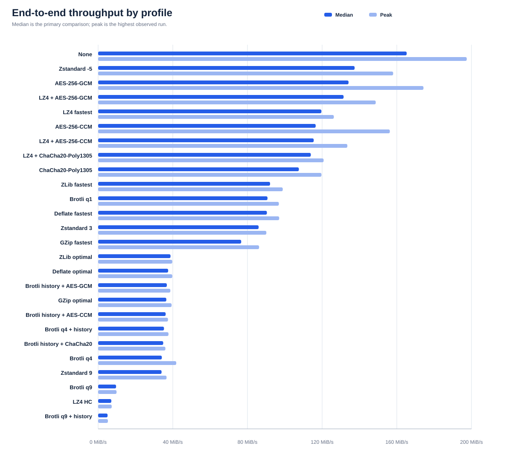

# End-to-end throughput benchmarks

Measured 2026-09-11 19:15 UTC on AMD64 Family 25 Model 33 Stepping 0, AuthenticAMD (X64, 32 logical processors) using .NET 11.0.0-rc.1.26425.128.

These loopback results measure the complete Application → Client → Server → destination path. They isolate framing, copying, compression, authenticated encryption and destination hashing cost; they do not predict throughput across a particular network.

## Interpretation

| Question | Recorded evidence | Interpretation |
| --- | --- | --- |
| How does Zstandard -5 compare with uncompressed? | Median 137.4 vs 165.3 MiB/s (-16.9%) | This run's median determines the displayed rank; it does not establish a universal ordering. |
| What does peak add? | Peak 158.0 vs 197.5 MiB/s (-20.0%) | Peak is one observation per profile and shows a transient ceiling rather than expected throughput. |
| Why can compression help without a bandwidth cap? | Loopback has no external link cap. | Bytes still incur framing, managed/native copies, TCP-buffer work, and scheduling. A fast codec can reduce that work enough to offset its CPU cost on compressible input. |
| Which value should be compared? | Median is the primary result; peak is retained separately. | Median is less sensitive to scheduler and cache outliers. Neither value predicts a real network without representative data and conditions. |

## Graph



## Results

| Rank | Profile | Settings | Input | Median MiB/s | Peak MiB/s |
| ---: | --- | --- | --- | ---: | ---: |
| 1 | None | uncompressed framing | Mixed DLL set | 165.3 | 197.5 |
| 2 | Zstandard -5 | level=-5 | Mixed DLL set | 137.4 | 158.0 |
| 3 | AES-256-GCM | encryption=AesGcm | Mixed DLL set | 134.1 | 174.3 |
| 4 | LZ4 + AES-256-GCM | level=Fastest, encryption=AesGcm | Mixed DLL set | 131.5 | 148.7 |
| 5 | LZ4 fastest | level=Fastest | Mixed DLL set | 119.6 | 126.3 |
| 6 | AES-256-CCM | encryption=AesCcm | Mixed DLL set | 116.5 | 156.3 |
| 7 | LZ4 + AES-256-CCM | level=Fastest, encryption=AesCcm | Mixed DLL set | 115.5 | 133.5 |
| 8 | LZ4 + ChaCha20-Poly1305 | level=Fastest, encryption=ChaCha20Poly1305 | Mixed DLL set | 113.9 | 120.8 |
| 9 | ChaCha20-Poly1305 | encryption=ChaCha20Poly1305 | Mixed DLL set | 107.5 | 119.6 |
| 10 | ZLib fastest | level=Fastest | Mixed DLL set | 92.1 | 98.9 |
| 11 | Brotli q1 | quality=1, window=22, history=false | Repeated mshtml.dll | 90.7 | 96.8 |
| 12 | Deflate fastest | level=Fastest | Mixed DLL set | 90.4 | 97.0 |
| 13 | Zstandard 3 | level=3 | Mixed DLL set | 86.0 | 90.1 |
| 14 | GZip fastest | level=Fastest | Mixed DLL set | 76.6 | 86.2 |
| 15 | ZLib optimal | level=Optimal | Mixed DLL set | 38.8 | 39.7 |
| 16 | Deflate optimal | level=Optimal | Mixed DLL set | 37.5 | 39.7 |
| 17 | Brotli history + AES-GCM | quality=4, window=22, history=true, encryption=AesGcm | Repeated mshtml.dll | 36.8 | 38.7 |
| 18 | GZip optimal | level=Optimal | Mixed DLL set | 36.5 | 39.4 |
| 19 | Brotli history + AES-CCM | quality=4, window=22, history=true, encryption=AesCcm | Repeated mshtml.dll | 36.2 | 37.4 |
| 20 | Brotli q4 + history | quality=4, window=22, history=true | Repeated mshtml.dll | 35.3 | 37.7 |
| 21 | Brotli history + ChaCha20 | quality=4, window=22, history=true, encryption=ChaCha20Poly1305 | Repeated mshtml.dll | 34.9 | 36.0 |
| 22 | Brotli q4 | quality=4, window=22, history=false | Repeated mshtml.dll | 34.1 | 41.9 |
| 23 | Zstandard 9 | level=9 | Mixed DLL set | 34.0 | 36.7 |
| 24 | Brotli q9 | quality=9, window=22, history=false | Repeated mshtml.dll | 9.6 | 9.9 |
| 25 | LZ4 HC | level=SmallestSize | Mixed DLL set | 7.1 | 7.3 |
| 26 | Brotli q9 + history | quality=9, window=22, history=true | Repeated mshtml.dll | 5.1 | 5.2 |

## Input files

| File | Size (MiB) | SHA-256 |
| --- | ---: | --- |
| mshtml.dll | 22.9 | `4093242363e953e6172b87f5b66ec42deaf63bb1fb12a2a48590c08f8fb6ec06` |
| Windows.UI.Xaml.dll | 17.0 | `b0a1d10f9766565658bf210ee521861dfa16fb22b331925fc1f039ef626ad2cb` |
| shell32.dll | 7.6 | `a7779772d197cd94a2309d4739b85587d7e86a20e406baec4932307d71bbc2d2` |

## Methodology

| Parameter | Value |
| --- | --- |
| Platform | Microsoft Windows 10.0.26200 |
| Execution | Async; 1 MiB tunnel and file-copy buffers; zero application batching delay |
| Runs | 1 warm-up(s), then 7 measured transfer(s) of at least 64 MiB per profile |
| Reported speed | Median application-data rate is primary; peak is the highest observed run |
| Brotli input | Largest selected DLL repeated on one connection; history-enabled and disabled profiles receive the identical sequence |
| Other input | Selected DLLs cycled in order; warm-ups populate the OS page cache |
| Validation | Sink verifies exact byte count, SHA-256 digest and half-close; encrypted profiles use TTN3 with the stated cipher after compression |
| Limitation | Tunnel-wire byte count is not recorded, so codec throughput differences cannot be decomposed into compression ratio and processing cost |

## Reproduce

Run from the repository root on Windows with the SDK pinned by `global.json`:

```powershell
dotnet run --project src/Tedd.TcpTunnel.Benchmarks -c Release -- --throughput --target-mib 64 --warmups 1 --iterations 7 --output benchmarks.md --json-output website/benchmarks.json --svg-output website/benchmarks.svg
```

Use repeated `--file PATH` arguments to supply a different corpus. On non-Windows systems, at least one `--file` is required.
